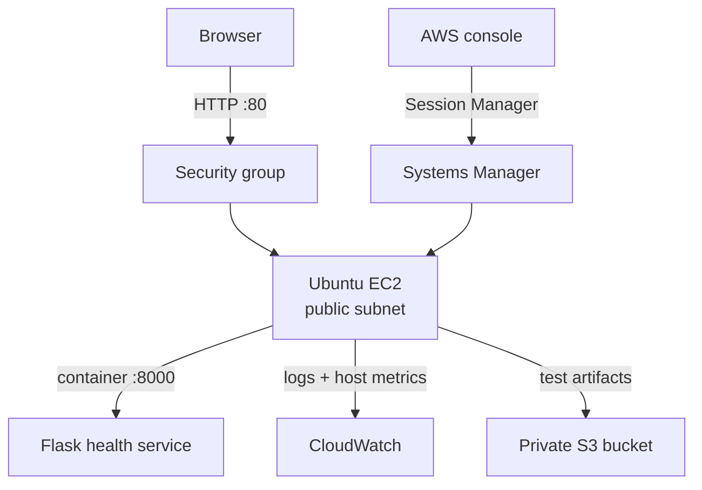

# AWS Cloud Operations Mini-Platform

## Goal

I built this project to translate my Ubuntu, Docker, and monitoring homelab experience into a small AWS environment I could deploy, secure, monitor, and troubleshoot myself.

I kept the first phase narrow: one manually deployed workload, one clear network path, keyless administrative access, private storage, host telemetry, and cost guardrails. My goal was to understand each moving part before reproducing the environment with Terraform.

## Decisions

| Decision | Why I made it |
|---|---|
| AWS first | It aligns with the cloud-operations roles I am targeting and keeps me focused on one provider. |
| `us-east-1` | A single region simplified resource tracking and cleanup while providing broad service availability. |
| EC2 before ECS | Direct host access exposed the Linux, Docker, IAM, networking, logging, and service-management layers I wanted to learn. |
| Session Manager instead of SSH | I avoided a public SSH rule and tied administrative access to AWS identity controls. |
| Manual deployment before Terraform | I wanted the later infrastructure code to reproduce a system I already understood. |
| One host and one Availability Zone | High availability would have added cost and complexity before I had operated the base system. |

## Build

I created a VPC and public subnet, attached an internet gateway, and allowed only TCP port `80` for the public application path. I used an EC2 instance role and Systems Manager Session Manager for administration, so the host did not need stored AWS keys or an inbound SSH rule.

On Ubuntu EC2, I deployed a small Flask service with Docker Compose and Gunicorn. The container listens on port `8000`, while Compose publishes the service on host port `80`. I configured a private S3 bucket with public access blocked, versioning enabled, and SSE-S3 encryption. I also installed the CloudWatch Agent, sent container logs to CloudWatch, collected host memory and disk metrics, and configured a `$10` monthly AWS budget.

The exact application and container configuration are available in [`app/`](app/).

## Validation

I treated deployment and proof as separate steps. I validated that:

- the EC2 instance was running and passed both status checks;
- the security group exposed HTTP on TCP `80` without exposing SSH;
- Session Manager provided administrative access;
- the Docker container reported healthy;
- `/health` and `/version` returned HTTP `200`;
- the CloudWatch Agent reported `running` and `configured`;
- recent memory and disk datapoints arrived in CloudWatch;
- the S3 privacy, versioning, and encryption controls were enabled;
- the budget and four alert thresholds were active.

The complete evidence set is in the [Phase 1 evidence gallery](docs/screenshots/README.md).

## Lessons learned

The most useful failure happened when `curl http://localhost/health` returned nginx's `404 Not Found` page. The request had reached a web server, but it had not reached the Flask health endpoint. I separated the host listener, Docker port mapping, container state, and application route during diagnosis, then validated the final path with HTTP `200` responses.

I also learned that an installed monitoring agent is not proof of working telemetry. I waited for recent CloudWatch datapoints before treating monitoring as complete.

This phase deliberately stops short of Terraform, CI/CD, high availability, autoscaling, and recovery testing. Those are follow-on phases, not claims attached to this build.

## Detailed documentation

- [Account and cost guardrails](docs/00-account-guardrails.md)
- [Architecture](docs/01-architecture.md)
- [Networking and access](docs/02-networking-access.md)
- [Compute and application](docs/03-compute-application.md)
- [Storage, monitoring, and cost controls](docs/04-storage-monitoring-cost.md)
- [Phase 1 evidence gallery](docs/screenshots/README.md)
