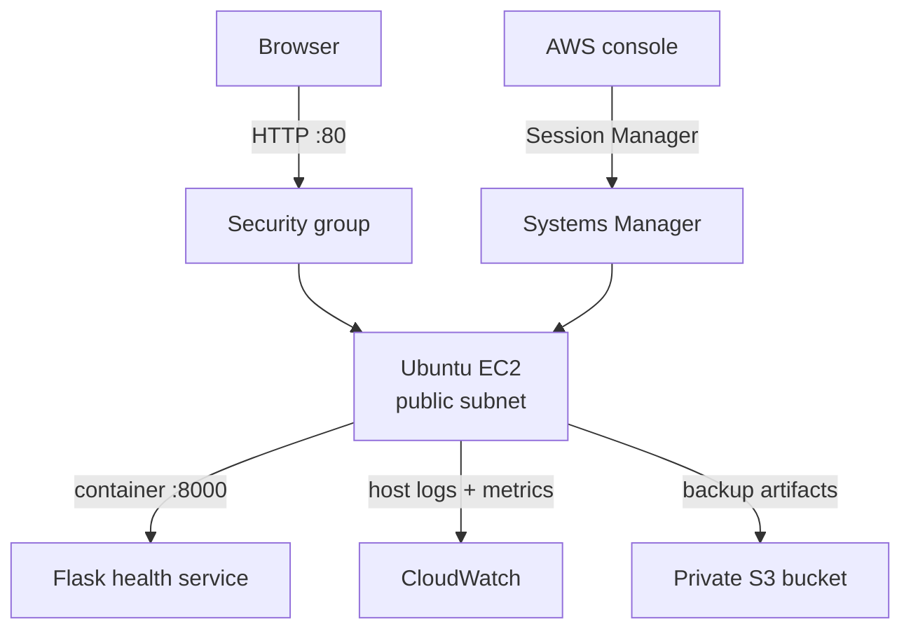

# AWS Cloud Operations Mini-Platform

This is a small AWS operations lab built to translate my Ubuntu, Docker, and monitoring homelab experience into public-cloud work I can explain and troubleshoot.

I deployed Phase 1 manually on purpose. Before automating the environment, I wanted to understand the network path, host access, instance role, container runtime, log collection, storage controls, and cost risks as separate moving parts.

## Current status

**Phase 1 manual deployment is complete. Public evidence is still being sanitized and added to this branch.**

The distinction matters: a deployed resource is not portfolio evidence until its configuration and validation are visible without exposing account details or credentials.

| Area | Deployment status | Public evidence status |
|---|---|---|
| Account and budget guardrails | Complete | Documentation complete; screenshot pending |
| VPC, subnet, route, and security group | Complete | Documentation complete; screenshot pending |
| Ubuntu EC2 and Session Manager access | Complete | Terminal validation recorded; screenshot pending |
| Dockerized application | Complete | Source/config export and healthy endpoint screenshot pending |
| Private S3 storage | Complete | Permissions and properties screenshots pending |
| CloudWatch agent, metrics, and logs | Complete | Agent status recorded; console screenshot pending |
| Failure and recovery drill | Not started | Planned for Phase 2 |
| Terraform rebuild | Not started | Planned for Phase 3 |
| CI validation | Not started | Planned for Phase 4 |

## Architecture

The diagram is intentionally small. This phase does not use a NAT Gateway, load balancer, RDS, ECS, EKS, or Kubernetes.

## What Phase 1 demonstrates

- A single-region VPC and public-subnet network path that I can trace from the route table to the security group and application port.
- IAM-controlled administration through AWS Systems Manager Session Manager instead of exposing SSH to the internet.
- A Dockerized application with local and browser validation endpoints.
- Private S3 storage with public access blocked, versioning enabled, and server-side encryption.
- CloudWatch host metrics and logs collected by the CloudWatch Agent.
- Budget alerts and cleanup checks designed for a low-cost lab.

## Key decisions

| Decision | Reason |
|---|---|
| AWS first | Keeps the project aligned with the cloud-operations roles I am targeting without splitting effort across providers. |
| `us-east-1` | One region keeps resource discovery and cleanup simple and provides broad service availability. |
| EC2 before ECS | Direct host access makes Linux, Docker, IAM, networking, logs, and service management visible instead of hiding them behind a managed platform. |
| Session Manager before SSH | Removes the need for a public inbound SSH rule and ties administration to AWS identity and audit controls. |
| Manual before Terraform | Terraform will reproduce a configuration I already understand rather than mask gaps in the manual build. |

## Documentation

- [Account and cost guardrails](docs/00-account-guardrails.md)
- [Architecture](docs/01-architecture.md)
- [Networking and access](docs/02-networking-access.md)
- [Compute and application](docs/03-compute-application.md)
- [Storage, monitoring, and cost controls](docs/04-storage-monitoring-cost.md)
- [Screenshot and redaction checklist](docs/screenshots/README.md)

## Evidence standard

The repository uses three evidence levels:

- **Recorded:** backed by command output captured during the build.
- **Screenshot pending:** configured and reported complete, but not yet supported by a sanitized public image.
- **Planned:** not completed and not described as working.

A `404 Not Found` response is not accepted as a health-check result. The final application proof must show a `200` response from `/health` and a running container, not the nginx default site.

## Next phase

Phase 2 will create an operations story instead of adding more services: introduce one controlled failure, observe the alert/log path, restore the service, document the timeline and root cause, and make one corrective change.

## Scope boundary

This is an independent lab, not production AWS experience. Terraform, CI/CD, high availability, autoscaling, and incident recovery are not claimed until their later phases are completed and evidenced.
