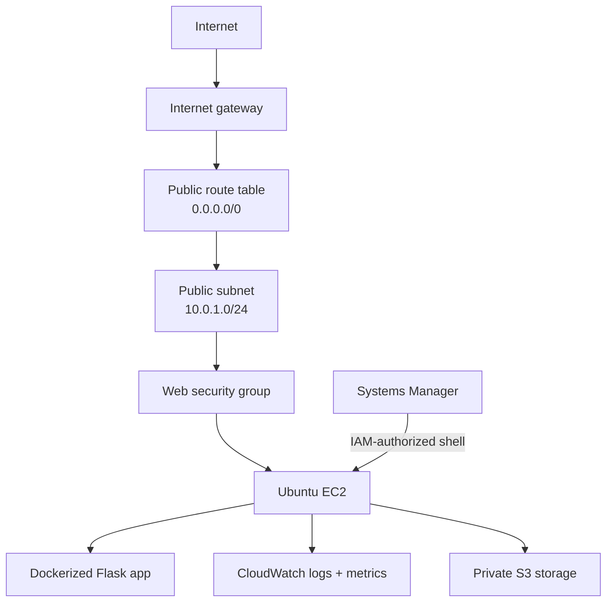
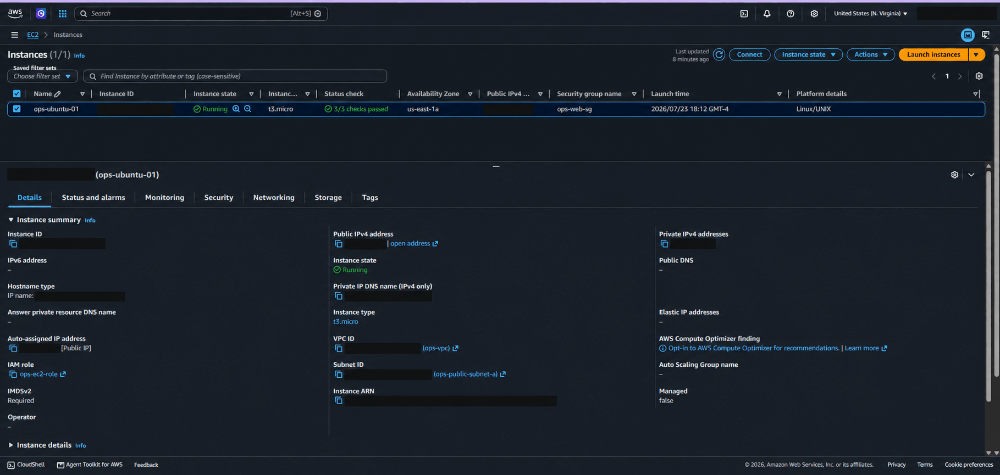

# Phase 1 Architecture

## Goal

Phase 1 took shape as a small manual deployment connecting AWS networking, compute, identity, containers, storage, monitoring, and cost controls. Managed services that did not support the first operations story stayed out of scope.

## Decisions

A single VPC, public subnet, EC2 instance, and Availability Zone kept the request path visible and the monthly cost low.

For administration, I chose Session Manager instead of public SSH. An EC2 instance role lets the host reach Systems Manager and CloudWatch without static AWS credentials, while S3 remains outside the public request path with public bucket access blocked.

A load balancer, private application subnet, database, autoscaling group, NAT Gateway, and container orchestrator all remained out of scope. Adding them before validating the base system would have introduced cost and new failure modes.

## Build

| Component | Role in my build |
|---|---|
| VPC `10.0.0.0/16` | Created the network boundary and room for later subnet separation. |
| Public subnet `10.0.1.0/24` | Hosted the Phase 1 EC2 instance. |
| Internet gateway and route table | Provided public HTTP access and outbound package retrieval. |
| Security group | Allowed application traffic on TCP `80` without allowing public SSH. |
| Ubuntu EC2 | Ran Docker, the Flask application, and the CloudWatch Agent. |
| EC2 instance role | Supplied SSM and CloudWatch permissions without stored access keys. |
| Session Manager | Provided administrative shell access. |
| Private S3 bucket | Stored test artifacts with public access blocked. |
| CloudWatch | Received host metrics and application logs. |
| AWS Budgets | Warned when actual or forecasted spend crossed my lab thresholds. |

## Validation

The EC2 overview confirmed a running instance, two passing status checks, the expected Availability Zone and instance type, an attached IAM role, and required IMDSv2.

End-to-end validation covered both the request path and control plane: public HTTP reached port `80`, Session Manager reached the host without SSH, the container served the Flask endpoints, CloudWatch received telemetry, and the S3 bucket remained private.

## Lessons learned

A route to an internet gateway does not expose a workload by itself. The request still has to pass the security group and reach a process listening on the mapped host port.

Keeping the first architecture small made troubleshooting clearer. When the health check failed, I could isolate the issue among nginx, the host listener, Docker's port mapping, and the Flask route instead of debugging through a load balancer or orchestration layer.
