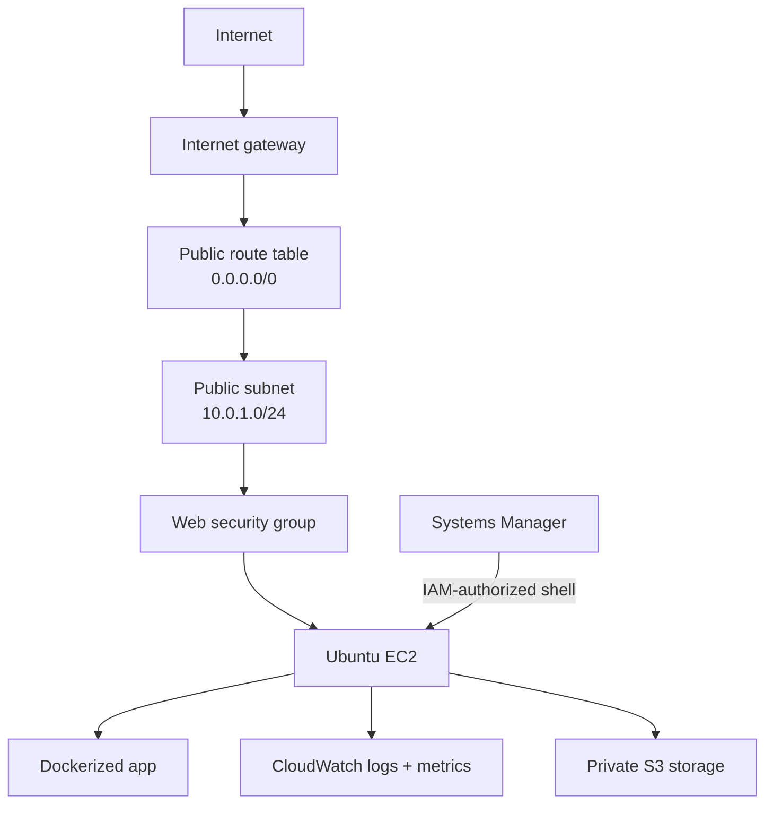

# Phase 1 Architecture

## Goal

Phase 1 is a deliberately narrow manual deployment. It proves that I can connect AWS networking, compute, IAM, containers, storage, monitoring, and cost controls without adding managed services that do not help the first operations story.

## Resource path

## Components

| Component | Phase 1 responsibility |
|---|---|
| VPC `10.0.0.0/16` | Network boundary for the lab. |
| Public subnet `10.0.1.0/24` | Hosts the single EC2 instance and routes outbound traffic through the internet gateway. |
| Internet gateway and route table | Provide the public HTTP and package-download path. |
| Security group | Allows only the application traffic required for the test; no public SSH rule is needed. |
| Ubuntu EC2 | Runs Docker, the application container, nginx where retained, and the CloudWatch Agent. |
| EC2 instance role | Grants the host its SSM and CloudWatch permissions without storing AWS access keys on disk. |
| Systems Manager Session Manager | Administrative access to the host. |
| Private S3 bucket | Stores test backup or artifact data with public access blocked. |
| CloudWatch | Receives default EC2 metrics plus agent-collected host metrics and logs. |
| AWS Budgets | Warns when actual or forecasted spend crosses the lab thresholds. |

## Trust boundaries

- Public HTTP reaches only the web security group and the application listener.
- Administrative access enters through Session Manager and depends on AWS identity permissions plus the EC2 instance role.
- The instance uses role credentials supplied by AWS; no static access key belongs on the host or in this repository.
- S3 is not part of the public request path. Public access is blocked.
- CloudWatch receives telemetry from the host; log retention must remain short enough for a lab.

## Deliberate omissions

The manual phase has one host and one Availability Zone. It does not claim high availability. A load balancer, private application subnet, database, autoscaling group, NAT Gateway, or container orchestrator would add cost and failure modes before the base system has been operated and recovered.

## Evidence

The sanitized overview retains the running state, status checks, Availability Zone, instance type, security-group name, IAM role, and IMDSv2 setting. Account, network, and resource identifiers were removed because they add no value to the architecture explanation.
