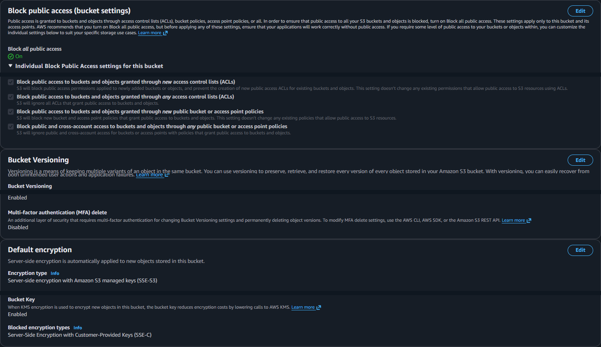

# Storage, Monitoring, and Cost Controls

## Goal

Beyond simply running an EC2 instance, the lab needed three operational controls: private object storage, telemetry that proved the host was observable, and budget warnings that made cost visible.

## Decisions

S3 stores test artifacts rather than public website content. Its baseline blocks all public access, enforces bucket ownership, enables versioning, and uses SSE-S3 default encryption.

Default EC2 metrics do not include the host memory and disk measurements I wanted, so the design uses the CloudWatch Agent. A `$10` monthly budget and the exclusion of higher-cost services kept Phase 1 cost-conscious.

## Build

### Private S3 storage

The bucket uses:

| Control | Setting |
|---|---|
| Block Public Access | All four settings enabled |
| Object Ownership | Bucket owner enforced; ACLs disabled |
| Versioning | Enabled |
| Default encryption | SSE-S3 |
| Public bucket policy | None |

### CloudWatch setup

On the EC2 host, the CloudWatch Agent supplements default EC2 metrics with memory and disk measurements. Docker Compose also uses the `awslogs` driver to send application logs to CloudWatch Logs in `us-east-1`.

### Cost controls

The `$10` monthly budget sends notifications at:

- `$1` actual spend;
- `$5` actual spend;
- `$10` actual spend;
- `$10` forecasted spend.

Free Tier usage notifications add another warning layer. NAT Gateway, Elastic Load Balancing, RDS, Fargate, and EKS remain outside this phase.

## Validation

### S3 controls

The console evidence shows all four Block Public Access settings, versioning, and SSE-S3 encryption without exposing the bucket name.

### CloudWatch telemetry

Recent memory and disk datapoints appeared with the Average statistic, a 5-minute period, and a 1-hour view. That result proved telemetry reached CloudWatch rather than merely showing that the agent was installed.

### Budget alerts

The budget evidence shows the monthly limit and actual/forecast thresholds while excluding notification recipients.

## Lessons Learned

Monitoring had two separate success conditions: the agent had to be running on the host, and CloudWatch had to show recent datapoints. Both had to be true before the setup counted as complete.

Versioning and encryption improved the S3 baseline, but they did not make the bucket private on their own. Blocking public access and avoiding a public bucket policy were separate controls.

The budget reduced the chance of silent cost growth, but it was not a hard cap. Cleanup and deliberate service selection remained the real controls.
