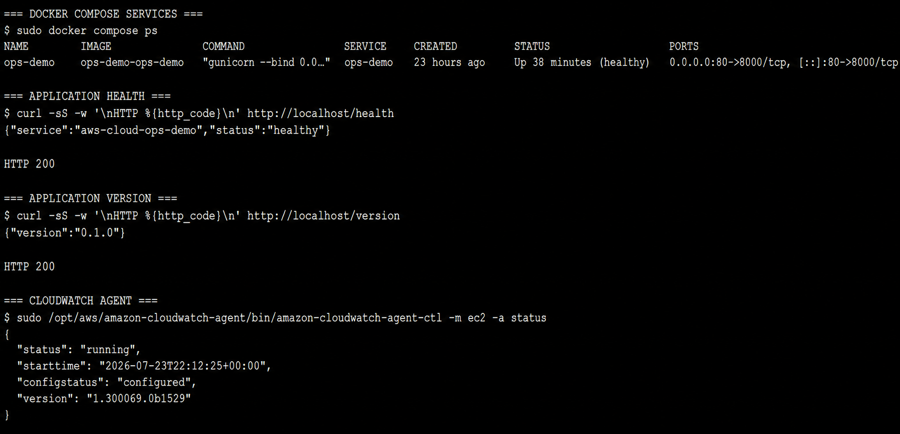

# Phase 1 Evidence Gallery

## Goal

The evidence set stays small and focuses on claims that configuration files or prose cannot prove by themselves. Each image records an actual deployment state or validation result from Phase 1.

## Decisions

Six screenshots cover compute, network exposure, runtime health, storage controls, telemetry, and cost alerts. To keep them focused and safe to publish, I cropped repeated browser chrome and removed account IDs, IP addresses, resource IDs, ARNs, email addresses, session identifiers, internal hostnames, and globally unique bucket names.

Service names, states, ports, metric names, policy names, and timestamps remain visible because they support the technical story.

## Evidence

Each screenshot is embedded below and links to the full-resolution file.

### 1. EC2 overview

The instance was running, passed its status checks, used the expected Availability Zone and instance type, had the security group and IAM role attached, and required IMDSv2.

### 2. Network controls

The security group allowed public HTTP on TCP `80` and had no inbound SSH rule.

### 3. Session and health

The container was healthy, `/health` and `/version` returned HTTP `200`, and the CloudWatch Agent was running and configured.

### 4. S3 private controls

All four Block Public Access settings were enabled, versioning was enabled, and default encryption used SSE-S3.

### 5. CloudWatch telemetry

Recent memory and disk datapoints reached CloudWatch with the Average statistic, 5-minute period, and 1-hour range.

### 6. Budget alerts

The `$10` monthly budget and actual/forecast alert thresholds were configured.

## Lessons Learned

A screenshot is useful only when it proves a meaningful claim. Separate images for Docker versions, every endpoint, each CloudWatch log group, or every VPC component would repeat evidence without strengthening the project story, so they were left out.

Sanitizing the screenshots also reinforced the importance of evidence integrity. Removing identifiers reduced unnecessary exposure while keeping the configuration outcome readable. The result is enough to verify the Phase 1 claims without publishing account-specific details.
