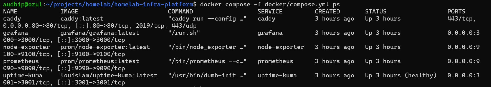
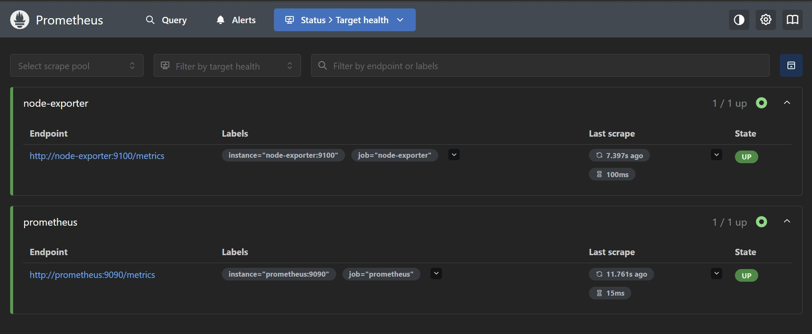
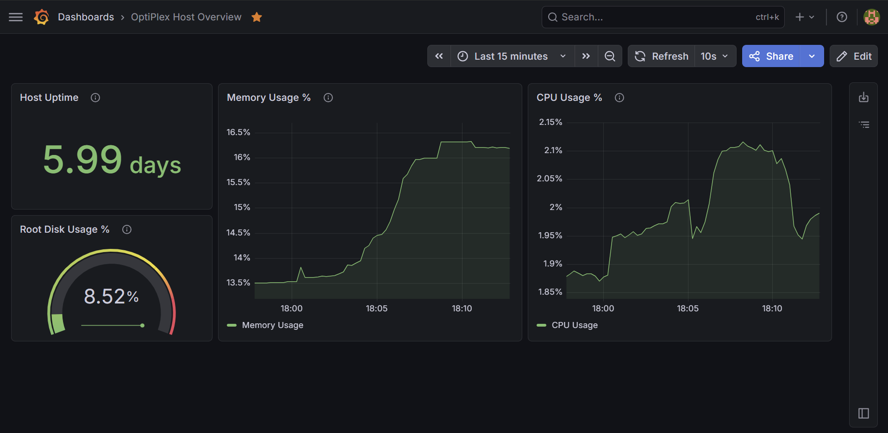
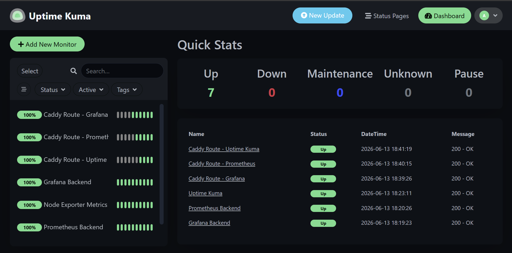

# Homelab Infrastructure Platform

A low-cost infrastructure automation homelab built on an Ubuntu Dell OptiPlex. The project is designed to show practical DevOps and cloud-infrastructure skills with a small, reproducible platform: Docker Compose services, Ansible host configuration, monitoring, reverse proxy routing, scripts, documentation, and CI validation.

This repository is public-safe by design. Real secrets, passwords, tokens, private keys, and local-only inventory values should stay out of version control.

## Project Objective

The goal is to build a resume-ready homelab that demonstrates operational habits, not just tool installation. The current focus is:

- Running a small monitoring stack on inexpensive hardware.
- Managing host baseline configuration with Ansible.
- Exposing internal services through a simple Caddy reverse proxy.
- Validating changes with safe local commands and GitHub Actions.
- Documenting what is complete separately from what is planned.

## Current Completed Milestone

The current milestone is a working monitoring and reverse-proxy stack on the Ubuntu OptiPlex.

Completed:

- Docker Compose monitoring stack is running.
- Services include Grafana, Uptime Kuma, Prometheus, Node Exporter, and Caddy.
- Caddy routes friendly internal hostnames:
  - `http://grafana.ozul`
  - `http://kuma.ozul`
  - `http://prometheus.ozul`
- Prometheus scrape targets are configured for:
  - `prometheus`
  - `node-exporter`
- Ansible baseline playbook configures core packages, `/opt/homelab`, and UFW rules.
- Firewall baseline allows SSH and Caddy HTTP traffic through `tailscale0`.
- Repo hygiene and validation workflow are committed.

Planned, not yet claimed as complete:

- Grafana dashboard provisioning.
- Alerting rules and notification routing.
- Backup restore testing.
- Terraform resources for real cloud, VM, or network infrastructure.

## Architecture Summary

The homelab is accessed from a personal laptop over Tailscale and SSH. The OptiPlex runs Ubuntu and hosts the monitoring stack with Docker Compose. Caddy listens on port `80` and reverse proxies friendly internal hostnames to backend containers. Prometheus scrapes metrics from itself and Node Exporter. Grafana uses Prometheus metrics for dashboards, and Uptime Kuma monitors service availability.

See [docs/architecture.md](docs/architecture.md) and [docs/network-map.md](docs/network-map.md) for more detail.

## Tools Used

- Ubuntu on Dell OptiPlex
- Tailscale for private remote access
- SSH for administration
- Docker Compose for service orchestration
- Caddy for reverse proxy routing
- Prometheus for metrics collection
- Node Exporter for host metrics
- Grafana for dashboards
- Uptime Kuma for uptime checks
- Ansible for baseline host automation
- GitHub Actions for repository validation
- Shell scripts for health checks, deployment, and backup workflows

## How To Run The Stack

From the repository root:

```bash
docker compose -f docker/compose.yml up -d
```

Check service state:

```bash
docker compose -f docker/compose.yml ps
```

Stop the stack:

```bash
docker compose -f docker/compose.yml down
```

## How To Validate The Stack

Validate Docker Compose syntax:

```bash
docker compose -f docker/compose.yml config
```

Validate Caddy routes locally:

```bash
curl -I -H "Host: grafana.ozul" http://localhost
curl -I -H "Host: kuma.ozul" http://localhost
curl -H "Host: prometheus.ozul" http://localhost
```

Validate Node Exporter metrics:

```bash
curl http://localhost:9100/metrics | head
```

Validate Ansible connectivity and check-mode:

```bash
ansible -i ansible/inventory.ini homelab -m ping
ansible-playbook -i ansible/inventory.ini ansible/site.yml --check
```

## Screenshots

Docker Compose service status after deployment:



Prometheus targets with the configured scrape jobs up:



Grafana metrics dashboard:



Uptime Kuma service monitoring dashboard:



## Resume Value

This project demonstrates practical experience with Linux administration, Docker Compose, monitoring, reverse proxy configuration, Ansible automation, firewall-aware service exposure, operational runbooks, troubleshooting documentation, and CI-backed repo hygiene.

Example resume bullet:

> Built and documented a low-cost Ubuntu homelab platform using Docker Compose, Caddy, Prometheus, Grafana, Uptime Kuma, Node Exporter, Ansible, and GitHub Actions to demonstrate repeatable infrastructure operations and monitoring workflows.
