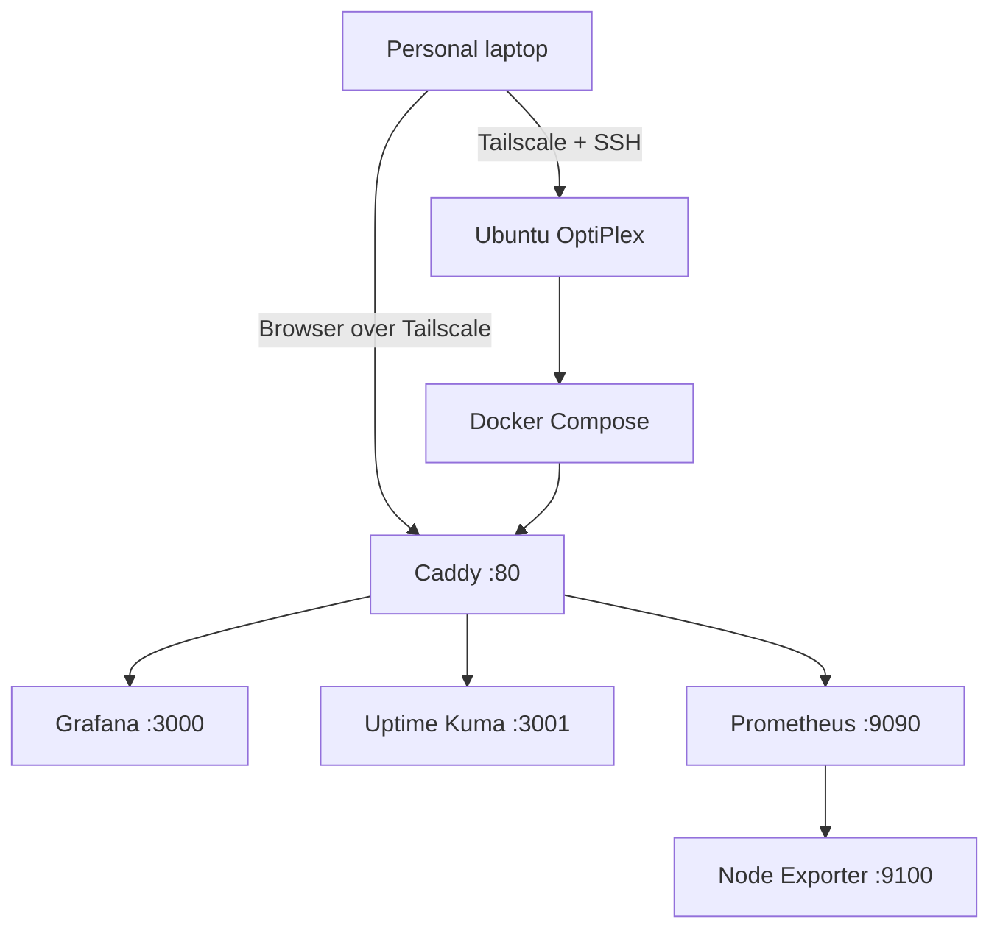

# Homelab Infrastructure Platform

## Goal

I built this project to turn a low-cost Dell OptiPlex into a small infrastructure platform I could operate remotely, automate, monitor, and troubleshoot.

The goal was not to install the largest possible toolset. Instead, the build connects Ubuntu administration, private remote access, containers, reverse proxy routing, metrics, uptime checks, host automation, operating scripts, and evidence in one understandable system.

## Decisions

| Decision | Why I made it |
|---|---|
| Reuse an Ubuntu OptiPlex | Existing hardware kept the cost low and exposed the host operating-system layer. |
| Tailscale for remote access | It gave my laptop a private path to the host without opening the dashboards directly to the public internet. |
| Docker Compose before Kubernetes | One host and five services did not need an orchestrator; Compose kept service relationships inspectable. |
| Caddy on port `80` | Friendly `.ozul` hostnames gave me one browser entry point instead of relying on backend ports. |
| Prometheus and Node Exporter | Prometheus collected both its own metrics and host metrics at a 15-second interval. |
| Grafana and Uptime Kuma | I separated metrics visualization from service-availability monitoring. |
| Ansible for the host baseline | Package installation, the `/opt/homelab` directory, and UFW policy became repeatable host configuration. |

## Build


```mermaid
flowchart TD
    laptop["Personal laptop"] -->|"Tailscale + SSH"| host["Ubuntu OptiPlex"]
    laptop -->|"Browser over Tailscale"| caddy["Caddy :80"]
    host --> compose["Docker Compose"]
    compose --> caddy
    caddy --> grafana["Grafana :3000"]
    caddy --> kuma["Uptime Kuma :3001"]
    caddy --> prometheus["Prometheus :9090"]
    prometheus --> exporter["Node Exporter :9100"]
```

The build started with a Compose scaffold for Grafana, Uptime Kuma, Prometheus, and Node Exporter. From there, I expanded the health-check script to inspect host and container state together.

Next came Caddy and a dedicated Prometheus configuration. Caddy reverse proxies three internal hostnames:

| Hostname | Backend |
|---|---|
| `http://grafana.ozul` | `grafana:3000` |
| `http://kuma.ozul` | `uptime-kuma:3001` |
| `http://prometheus.ozul` | `prometheus:9090` |

Prometheus scrapes `localhost:9090` for its own metrics and `node-exporter:9100` for host metrics. Matching network aliases on the Compose default network let the `.ozul` names resolve inside the stack as well as through Caddy's host-based routing.

The original Ansible placeholder then became a host baseline that:

- refreshes the apt cache and installs the core administration packages;
- creates `/opt/homelab` with root ownership and mode `0755`;
- denies incoming traffic by default and allows outgoing traffic;
- allows OpenSSH for host administration;
- allows TCP `80` through `tailscale0`;
- enables UFW.

The exact implementation is in:

- [`docker/compose.yml`](docker/compose.yml)
- [`docker/Caddyfile`](docker/Caddyfile)
- [`docker/prometheus.yml`](docker/prometheus.yml)
- [`ansible/site.yml`](ansible/site.yml)
- [`scripts/`](scripts/)

## Validation

Before starting or updating the stack, I validate the Compose model:

```bash
docker compose -f docker/compose.yml config
docker compose -f docker/compose.yml up -d
docker compose -f docker/compose.yml ps
```

From the Docker host, I validate the reverse-proxy routes:

```bash
curl -I -H "Host: grafana.ozul" http://localhost
curl -I -H "Host: kuma.ozul" http://localhost
curl -H "Host: prometheus.ozul" http://localhost
```

For Prometheus, the check uses `GET` because its web interface returns `405 Method Not Allowed` to the `HEAD` request generated by `curl -I`.

Host metrics and the Ansible path use a separate validation set:

```bash
curl http://localhost:9100/metrics | head
ansible -i ansible/inventory.ini homelab -m ping
ansible-playbook -i ansible/inventory.ini ansible/site.yml --check
```

[](docs/screenshots/docker-compose-ps.jpg)

The evidence set also includes:

- [Prometheus scrape targets](docs/screenshots/prometheus-targets.jpg)
- [Grafana metrics dashboard](docs/screenshots/grafana-dashboard.png)
- [Uptime Kuma service monitoring](docs/screenshots/uptime-kuma-dashboard.png)

## Lessons learned

Host networking and container networking are separate layers. Caddy needed the correct browser `Host` header, Docker service names for its upstreams, and network aliases for the internal `.ozul` names. Prometheus also needed its configuration mounted explicitly before Node Exporter appeared as a scrape target.

Several failures improved the operating model: Prometheus rejected a `HEAD` request even though the service was healthy, `curl` reported error `23` when `head` closed a metrics pipe early, and Ansible connectivity failed until I corrected unsafe permissions on a system SSH configuration file. The [troubleshooting record](docs/troubleshooting.md) preserves the exact symptoms and fixes.

This project still has clear boundaries. The Grafana dashboard and Uptime Kuma monitors are stored in service volumes rather than provisioned from committed configuration. The backup script has not passed a restore test, and its volume-name assumptions still need to be reconciled with Docker Compose. The Terraform directory contains no managed resources. A validation workflow definition is present under this project, but it is not active GitHub Actions CI because workflows must live at the repository-root `.github/workflows/` path.

## Detailed documentation

- [Architecture](docs/architecture.md)
- [Network and service map](docs/network-map.md)
- [Operations runbook](docs/runbook.md)
- [Troubleshooting record](docs/troubleshooting.md)
- [Terraform boundary](terraform/README.md)
