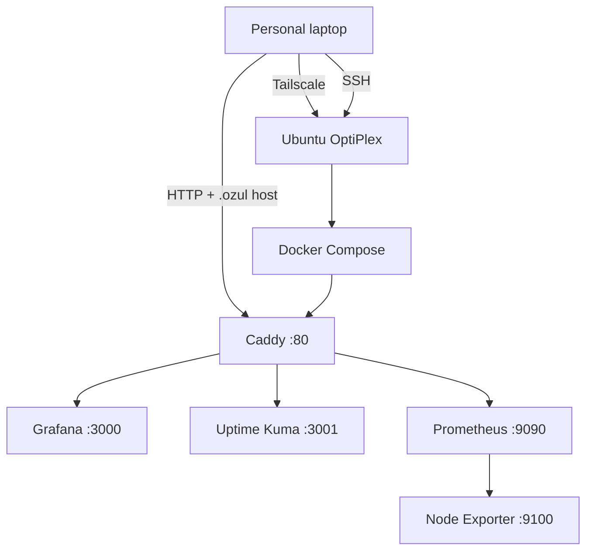
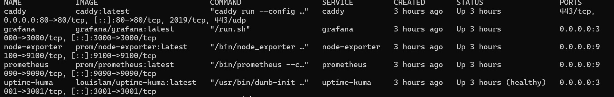
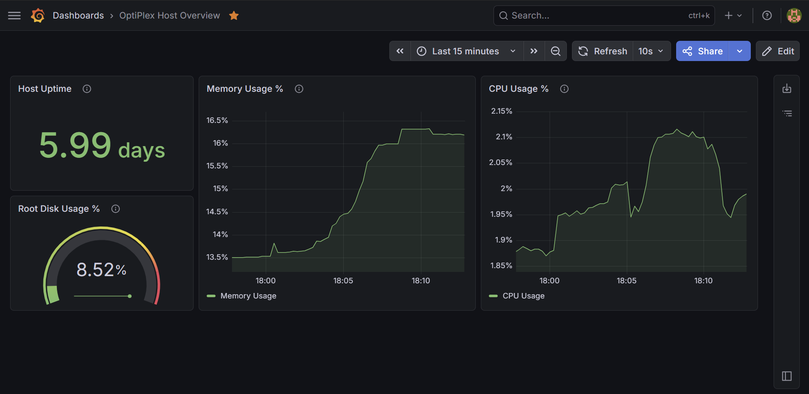
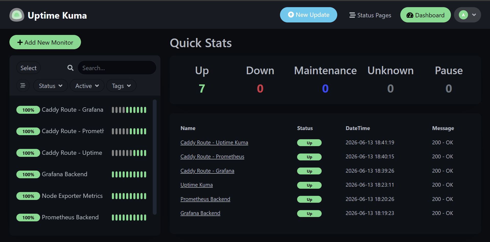

# Homelab Architecture

## Goal

The homelab began as a single-host platform I could reach privately, operate from one repository, and inspect from the Ubuntu host through each containerized service.

The architecture needed to stay useful without hiding the Linux, network, and container boundaries I was trying to learn.

## Decisions

The OptiPlex serves as both the Docker host and the Ansible-managed node. Splitting the first version across multiple machines would have increased hardware and network complexity without improving the initial monitoring objective.

Both the administrative and browser paths stay on Tailscale. SSH handles host operations, while Caddy provides the normal dashboard entry point on TCP `80` through `tailscale0`.

Each service has one responsibility:

| Component | Role in my build |
|---|---|
| Personal laptop | Operator workstation for SSH, browser access, Git, and Ansible. |
| Tailscale | Private path between the laptop and the OptiPlex. |
| Ubuntu OptiPlex | Docker host and Ansible-managed infrastructure node. |
| Docker Compose | Defines and runs the five-service stack from `docker/compose.yml`. |
| Caddy | Routes `.ozul` hostnames to the dashboard services. |
| Prometheus | Scrapes its own metrics and Node Exporter every 15 seconds. |
| Node Exporter | Exposes host metrics through the host root filesystem mount and host PID namespace. |
| Grafana | Visualizes Prometheus metrics. |
| Uptime Kuma | Tracks service availability. |
| Ansible | Applies the package, directory, and UFW baseline. |

## Build



The request and metrics flows are:

1. My laptop reaches the OptiPlex over Tailscale.
2. Browser requests arrive at Caddy on port `80` with a `.ozul` hostname.
3. Caddy sends the request to `grafana:3000`, `uptime-kuma:3001`, or `prometheus:9090` on the Compose network.
4. Prometheus scrapes `localhost:9090` and `node-exporter:9100`.
5. Grafana queries Prometheus for dashboards.
6. Uptime Kuma checks the configured service endpoints independently.

The Compose file also publishes ports `3000`, `3001`, `9090`, and `9100` on the host. Those bindings support direct validation, but Caddy remains the intended dashboard entry point. The Ansible baseline limits Caddy's inbound rule to TCP `80` on `tailscale0`; Node Exporter is not intended for broad exposure.

## Validation

Validation began with the running container set:

```bash
docker compose -f docker/compose.yml ps
```

The expected services were `caddy`, `grafana`, `uptime-kuma`, `prometheus`, and `node-exporter`.



The observability paths were checked separately:

- Prometheus showed both configured scrape jobs as healthy.
- Grafana displayed host metrics from the Prometheus data source.
- Uptime Kuma displayed the configured service monitors.


The captured Prometheus view reports the self-scrape endpoint as `prometheus:9090`, while the committed `docker/prometheus.yml` uses `localhost:9090`. Both address the Prometheus container from inside the Compose network, but the difference means the screenshot proves the two jobs were healthy at capture time rather than proving byte-for-byte parity with the current file.





## Lessons learned

The reverse proxy simplified normal access, but it did not remove the backend ports or container network. A complete request still depends on the laptop resolving the intended hostname, the Tailscale path, UFW, Caddy's `Host` match, Docker DNS, and the backend process.

Adding a monitoring container also turned out to be different from collecting metrics. Prometheus did not scrape Node Exporter until I created `docker/prometheus.yml`, mounted it at `/etc/prometheus/prometheus.yml`, and added `node-exporter:9100` as a target.

The single-host design is appropriate for this phase, but it is not highly available. If the OptiPlex, Docker daemon, Tailscale path, or local network fails, the platform becomes unavailable.
