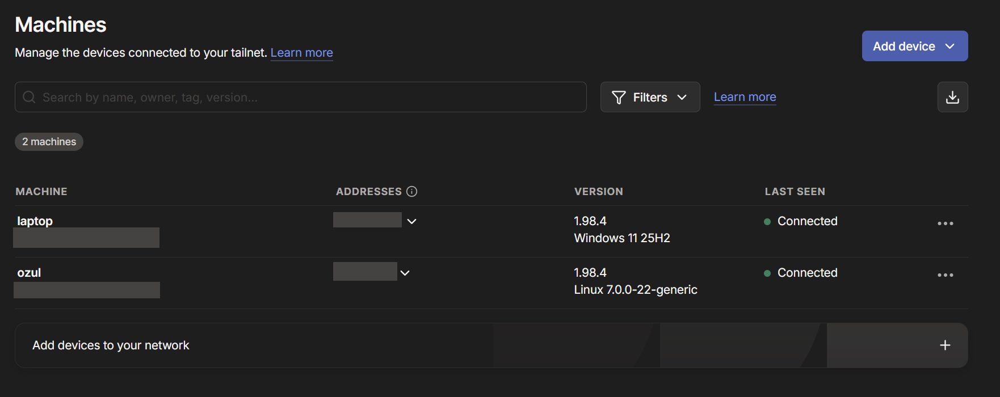

# Network Map

Use this file to document the network topology of the homelab without committing private addresses, secrets, or personal network details.

## Access Path

| Path | Purpose | Notes |
| --- | --- | --- |
| Personal laptop -> Tailscale -> OptiPlex | SSH and browser access | Preferred private management path |
| Personal laptop -> SSH -> OptiPlex | Git, Ansible, Docker operations | Uses local inventory values that are not committed |
| Browser -> Caddy hostnames | Dashboard access | Preferred over direct backend ports |

## Host Inventory

| Host | Role | Address |
| --- | --- | --- |
| Dell OptiPlex | Ubuntu Docker host | Use local Tailscale or DNS value outside Git |
| Personal laptop | Operator workstation | Use local Tailscale or DNS value outside Git |

## Reverse Proxy Hostnames

| Hostname | Routed Service | Backend Port | Purpose |
| --- | --- | ---: | --- |
| `grafana.ozul` | Grafana | 3000 | Metrics dashboards |
| `kuma.ozul` | Uptime Kuma | 3001 | Service availability dashboard |
| `prometheus.ozul` | Prometheus | 9090 | Metrics query and target status |

## Service Ports

| Port | Service | Exposure Notes |
| ---: | --- | --- |
| 80 | Caddy reverse proxy | Preferred browser entry point over Tailscale |
| 3000 | Grafana backend | May exist for local testing; prefer Caddy hostname |
| 3001 | Uptime Kuma backend | May exist for local testing; prefer Caddy hostname |
| 9090 | Prometheus backend | May exist for local testing; prefer Caddy hostname |
| 9100 | Node Exporter metrics | Should not be broadly exposed |

## Notes

- The OptiPlex is the Ubuntu Docker host for the monitoring stack.
- Tailscale is the intended remote access path for SSH and browser traffic.
- Caddy provides friendly internal hostnames for dashboards.
- Direct dashboard ports are useful for local testing, but normal access should go through Caddy.
- Node Exporter exposes host metrics and should remain limited to trusted lab access.

## Diagram

```text
Personal Laptop
       |
       | Tailscale / SSH / Browser
       v
Ubuntu OptiPlex
       |
       | Docker Compose
       v
Caddy :80
       |
       +--> grafana.ozul -> Grafana :3000
       +--> kuma.ozul -> Uptime Kuma :3001
       +--> prometheus.ozul -> Prometheus :9090

Prometheus :9090
       |
       +--> Node Exporter :9100
```

## Screenshots

Tailscale machines view for the remote access path:


