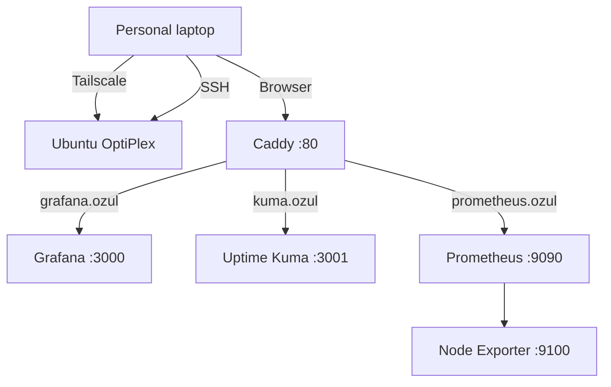
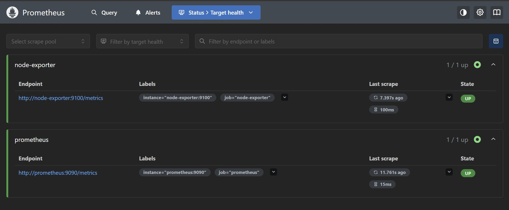

# Network and Service Map

## Goal

The network design needed a private management path and one memorable browser entry point without publishing personal addresses, credentials, or host inventory values in the repository.

## Decisions

Tailscale became the intended remote path between my laptop and the OptiPlex. Real inventory values stay in the untracked `ansible/inventory.ini` file; only the logical topology is documented here.

Caddy handles normal dashboard access on TCP `80`. Direct backend port mappings remain available for local testing and diagnosis, but they are not the preferred user path.

## Build

### Access paths

| Path | Purpose | Implementation |
|---|---|---|
| Laptop → Tailscale → OptiPlex | Private host reachability | Tailscale identity and device connectivity |
| Laptop → SSH → OptiPlex | Git, Ansible, and Docker operations | Local inventory values and SSH credentials |
| Browser → Caddy hostname | Dashboard access | TCP `80` through `tailscale0` |

### Reverse-proxy routes

| Hostname | Caddy upstream | Purpose |
|---|---|---|
| `grafana.ozul` | `grafana:3000` | Metrics dashboards |
| `kuma.ozul` | `uptime-kuma:3001` | Availability monitoring |
| `prometheus.ozul` | `prometheus:9090` | Metrics queries and target status |

### Service ports

| Port | Service | How I use it |
|---:|---|---|
| `22` | OpenSSH | Host administration |
| `80` | Caddy | Preferred dashboard entry point over Tailscale |
| `3000` | Grafana | Direct local testing |
| `3001` | Uptime Kuma | Direct local testing |
| `9090` | Prometheus | Direct local testing and self-scraping |
| `9100` | Node Exporter | Prometheus host-metrics target |


```mermaid
flowchart TD
    laptop["Personal laptop"] -->|"Tailscale"| optiplex["Ubuntu OptiPlex"]
    laptop -->|"SSH"| optiplex
    laptop -->|"Browser"| caddy["Caddy :80"]
    caddy -->|"grafana.ozul"| grafana["Grafana :3000"]
    caddy -->|"kuma.ozul"| kuma["Uptime Kuma :3001"]
    caddy -->|"prometheus.ozul"| prometheus["Prometheus :9090"]
    prometheus --> exporter["Node Exporter :9100"]
```

## Validation

On the host, Caddy routes are validated with explicit `Host` headers:

```bash
curl -I -H "Host: grafana.ozul" http://localhost
curl -I -H "Host: kuma.ozul" http://localhost
curl -H "Host: prometheus.ozul" http://localhost
```

Node Exporter is validated directly with:

```bash
curl http://localhost:9100/metrics | head
```

Finally, the Prometheus target view confirms the exporter path:



## Lessons learned

The hostname, listener, and upstream are three different checks. A `.ozul` name can resolve correctly while Caddy is stopped, and Caddy can respond while a backend container is unavailable. Passing the intended `Host` header during local tests lets me isolate Caddy routing without depending on laptop-side name resolution.

The Compose port mappings currently publish every backend on the host. Tailscale and UFW narrow the intended access path, but binding the dashboards to a private interface or removing unnecessary host mappings would create a stronger boundary in a later hardening phase.
